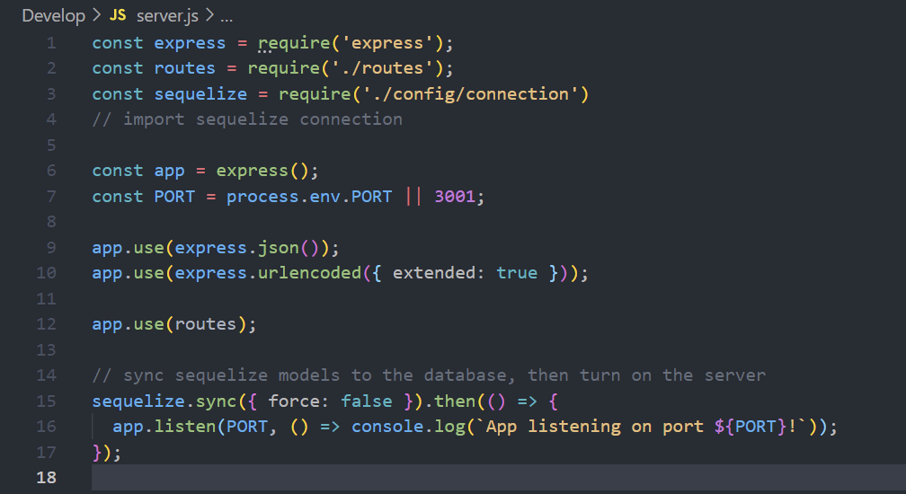
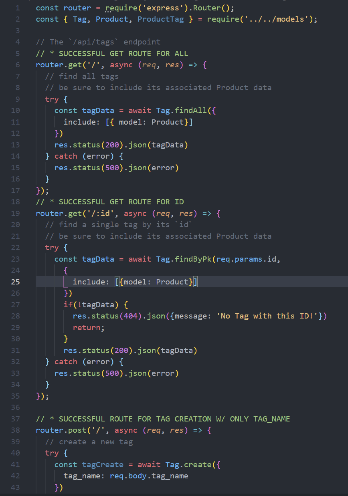
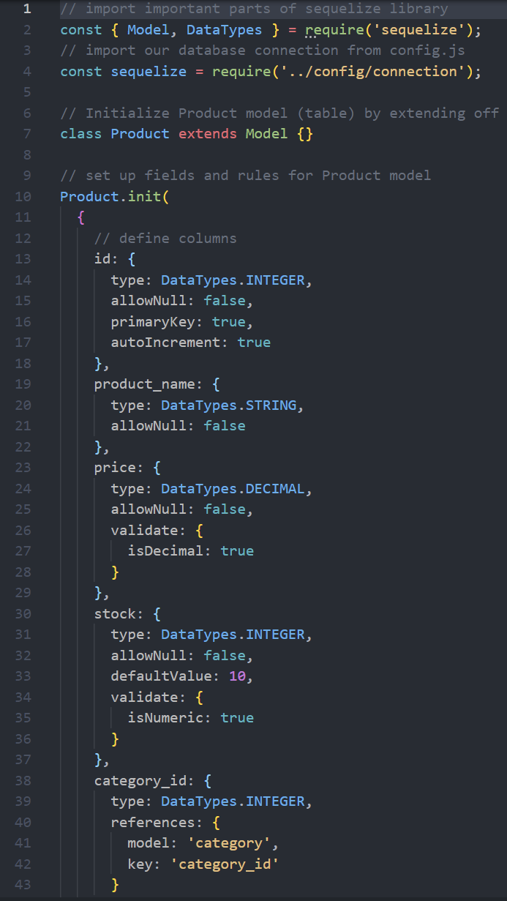

# E-Commerce Back End

## Introduction 

This application is run through node.js as a back end for a E-commerce site. This application is meant to store inforation for a business The application was configured as a working Express.js API that uses sequelize to interact with the MYSQL database. To see how this application runs and the system for how searches will work, click the walkthrough video below to watch this application at work.

[Walk Through video](https://youtu.be/5NgJpc5-3zw)

## Description 

This application uses a multitude of packages to run the server. It uses a dotenv package to secure the root password for mysql as well as use sequelize for the database structure and connection. It also use nodemon to watch the file and restart the server whenever there is a change made. Listed below are descriptions of certain files and screenshots of the source code.

### Server

As seen in the picture above the server requires the routes, models, sequelize and express in order to set up the connection with the database and the server. This also acts as a file to direct requests to use the routes folder and their javascript for each request.

### Routes 

The screenshot above is a snippet of the tag route. These routes use try and catches within the request method. These methods use async functions that synchronize the order of execustion for the code. Within the try, there is a call to include the model of product when the tag information is retrieved. THis line of code is implementing the models connection with one another to connect multipe items within the database to talk to eachother.

### Models

The Screenshot above shows what the product model source code looks like. Within the model files, sequelize is being required in order to call on that model class and extend it to the product class. By extending the class through the model, Product is able to use all the methods nested within model for later calls and functionality.

## Install 
To run this program, you will need to install the directory into your local machine, as well as download all the dependency packages that this application requires to run by running npm i within the console. 

Once that is completed, follow along with the walkthrough video to watch how to create the database and seed it as well. After that is done, running a node server.js is how the server is started and the application will be up and running. 

[Mysql2](https://www.npmjs.com/package/mysql2)

[Sequelize](https://sequelize.org/)

[express](https://www.npmjs.com/package/express)

[Visual Studio Code](https://code.visualstudio.com/)

[dotenv package](https://www.npmjs.com/package/dotenv)

[GitHub Repository](https://github.com/PN-Barnes/PN-Barnes.github.io)

[Github](https://github.com/)

[git](https://git-scm.com/downloads)

## Feedback

If you would like to leave any feedback, reach out to me through any of the contact links listed within the page. My contact information will be listed under the "Contact" tab. 

[LinkedIn](https://www.linkedin.com/feed/)

[GitHub](https://github.com/PN-Barnes)